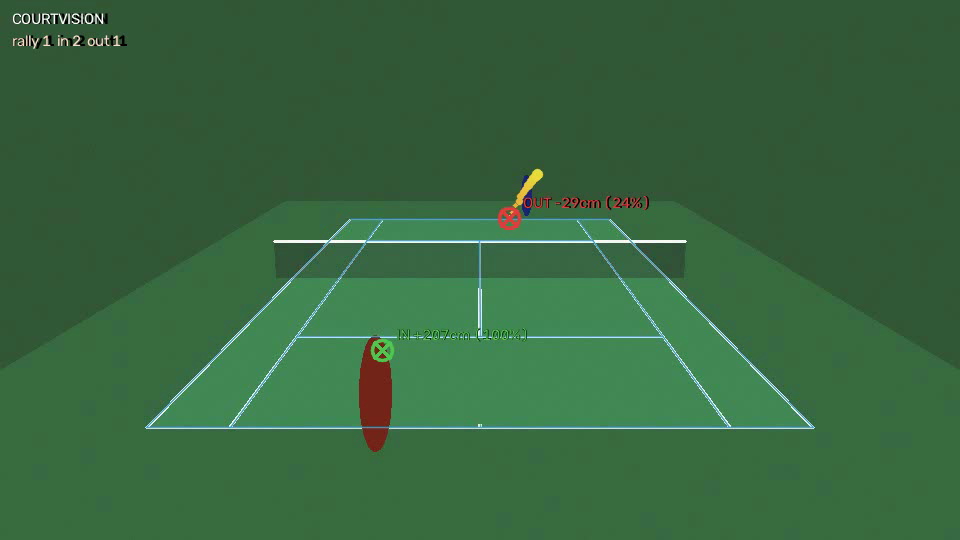

# 🎾 CourtVision

**AI tennis line calling and match stats — live or from recordings, from nothing
but the video.**

Point it at a fixed camera watching a tennis court — a webcam, an RTSP stream, or
a recording — and it will find the court, track the ball, detect every bounce,
call each one **IN** or **OUT** with a margin and a confidence, and compile match
statistics — rallies, shot counts, ball speeds, and a bounce heatmap. In live mode
calls are announced ~0.2 s after the ball lands, with an in-browser annotated feed
and live stats. 100% local, classical computer vision (OpenCV + NumPy), no GPU and
no cloud.

<div align="center">


*A deep ball called OUT by 29 cm — low confidence (24%) because it's within measurement noise of the line: a close call, flagged as such.*
</div>

---

## How it works

```
video ──► court detection ──► ball detection ──► tracking ──► bounce detection ──► line calls ──► stats
            (homography)        (motion +          (Kalman)      (velocity kink       (court-plane      (rallies, speeds,
                                 color prior)                     + arc refinement)    projection)       heatmaps, JSON)
```

1. **Court calibration** — extracts the white line mask, finds straight lines with a
   Hough transform, then searches line pairs whose intersections map the official
   ITF court model onto the image. The winning homography converts pixels ⇄ meters.
   For maximum accuracy you can instead supply the four doubles-court corner pixels
   (`--corners corners.json`).
2. **Ball detection** — background subtraction plus shape filters (area,
   circularity), an optic-yellow color prior, large-moving-object (player)
   exclusion zones, and static-region suppression — together these reject
   player fragments, spectators, and compression noise. Verified against
   per-frame JPEG compression, i.e. exactly what a phone camera stream sends.
3. **Tracking** — a constant-velocity Kalman filter with gating; brief dropouts are
   coasted through and back-filled, re-locks start new track segments.
4. **Bounce detection** — a bounce is a *kink* in the vertical image velocity: the
   ball is falling and its descent rate collapses at contact. (A sign flip isn't
   required — when the ball travels toward the camera, perspective can cancel the
   visible rebound entirely.) The contact point is refined by intersecting
   quadratic fits of the incoming and outgoing arcs. Racquet hits are separated
   from bounces physically: ground contact can't reverse the ball's horizontal
   direction of travel, a racquet usually does.
5. **Line calling** — the contact pixel is projected through the homography into
   court coordinates and ruled against ITF geometry: *lines belong to the court
   they bound*, and a ball touching any part of a line is IN — the contact patch
   radius is part of the geometry. Every call carries a margin (cm) and a
   confidence derived from the margin versus local measurement uncertainty, so
   close calls are flagged instead of oversold.
6. **Stats** — rallies segmented from ball presence, shot counts, estimated shot
   speeds (court-plane distance between contacts), in/out tallies, close-call
   counts, and a bounce-zone heatmap. Everything lands in `stats.json` plus an
   annotated replay video.

## Quickstart

```bash
pip install -e .

# built-in demo: renders a physics-simulated match, analyzes it,
# and scores the calls against exact ground truth
courtvision demo --out demo/

# your own footage (fixed camera, full court in view)
courtvision analyze match.mp4 --out out/
# highest accuracy: give it the four doubles-court corners once
courtvision analyze match.mp4 --out out/ --corners corners.json --mode singles
```

### Run it ON the phone — no computer at all

The entire pipeline is also ported to JavaScript and ships as a single-file web
app (`webapp/`): camera, corner-tap calibration with a magnifier loupe, live
IN/OUT verdicts with margins, spoken calls ("Out!" — like a real line judge),
haptics, rally stats, and a session summary with a top-view bounce map. All
processing happens on-device in the browser; nothing is uploaded anywhere.

- Build: `python webapp/build.py` → `webapp/dist/courtvision-app.html` — one
  file, host it on any static HTTPS host (GitHub Pages works: enable Pages for
  this repo and open
  `/courtvision/webapp/dist/courtvision-app.html`). HTTPS is required for
  camera access.
- Open it on the phone → *Open the camera* → tap the four court corners →
  play. A *Watch the demo* mode runs a simulated rally through the same
  engine, so you can try it anywhere.
- Verified: the JS engine reproduces the Python pipeline's calls exactly on a
  shared fixture (`node webapp/test/test_core.mjs` — homography, tracking,
  bounce, and call parity, plus a full JS-only detector e2e), and a headless-
  browser test drives the built app's demo to 9 correct calls.

### Take it to a court — with a laptop as the brain

No apps to install: the phone streams through its own browser.

```bash
courtvision live phone --serve --record
```

1. Connect the phone to the same wifi as your laptop and open the printed
   `https://<laptop-ip>:9443/` on the phone (self-signed certificate — tap
   through the warning once; traffic never leaves your network).
2. **Mount the phone** — landscape, steady (tripod, fence mount, or wedged
   against a bag), elevated if you can (head height minimum, higher is better),
   centered behind one baseline, with **the whole court in frame**.
3. On the phone: start the camera → **tap the four doubles-court corners**
   (near-left → near-right → far-right → far-left, the *outer* edges of the
   outermost lines) → start streaming. Or skip the taps and let auto-detection
   try.
4. Play. Calls stream to the laptop console, the annotated feed is at
   `http://localhost:8765`, and the phone screen itself becomes a live
   scoreboard showing every call. Corners are saved to `corners.json` so a
   recording from the same mount can be re-analyzed later with `analyze`.

Court-day tips:

- **Lock exposure/focus** in the camera view if your browser offers it; avoid
  shooting into the sun.
- Higher and farther is more accurate than low and close: bounce localization
  degrades at the far court when the camera is at eye level.
- Playing with non-yellow balls (or under sodium lights)? add
  `--no-color-prior`.
- Wind-blown banners, spectators, and the players themselves are filtered by
  motion/color/static-region logic, but a *moving camera is not supported* —
  if the phone gets bumped, redo the corner taps (the page lets you re-tap
  mid-session).

### Other live sources

```bash
# webcam 0, watch the annotated feed + live stats at http://localhost:8765
courtvision live 0 --serve

# an IP camera
courtvision live rtsp://192.168.1.20/stream --serve --record

# no camera handy? simulated live match, paced in real time
courtvision live sim --serve
```

Calls stream to the console the moment they're ruled:

```
[00:00.2] court calibrated - line calling active
[00:01.0] rally started
[00:02.3] IN   margin +216.5 cm  conf 99%  at (7.47, 17.98) m
[00:05.4] OUT  margin  -20.6 cm  conf 17%  at (6.75, 24.01) m  (close call)
[00:06.7] rally over: 3 shots, 3 bounces, 4.7s, avg 39 km/h - last ball OUT
```

The `--serve` viewer is a dependency-free MJPEG server: `/` is the viewer page,
`/stream` the annotated feed, `/stats.json` the cumulative stats — poll it from a
scoreboard or OBS overlay. A verdict needs a few frames of post-bounce trajectory
(to confirm the contact kink and rule out a racquet hit), so the typical
call latency is ~6 frames — **0.2 s at 30 fps** — with a hard test-enforced bound
of 0.6 s even through brief occlusions. Live mode runs the *same* detection,
tracking, and calling code as batch mode; a parity test asserts identical
verdicts on the same footage.

`corners.json` is four pixel coordinates — near-left, near-right, far-right,
far-left doubles corners:

```json
{"corners": [[236, 434], [723, 434], [652, 175], [307, 175]]}
```

Outputs:

- `stats.json` — every call (decision, margin in cm, confidence, court position,
  zone), per-rally stats, speeds, bounce-zone histogram
- `overlay.mp4` — annotated replay: reprojected court model, ball trail, IN/OUT
  markers with margins, live tallies

## Verified accuracy

The test suite includes a **physics-simulated match with exact ground truth** —
gravity, restitution, a pinhole camera, video-codec compression and all. On it,
CourtVision currently scores:

- **9/9 line calls correct** (including a ball 2 cm inside the line and clear outs)
- **2–30 cm bounce localization error** (mean ≈ 10 cm), single 540p camera
- close calls (margin within measurement noise) are correctly reported with low
  confidence rather than false certainty
- automatic court detection lands within **5 px** of the true corners

- live mode reproduces batch verdicts exactly, with median call latency ≤ 8
  frames
- 9/9 calls correct through *per-frame JPEG* compression — the phone-camera
  streaming path — with zero phantom calls

Run it yourself: `python -m pytest` (42 tests) or `courtvision demo`.

## Honest limitations

This is a single-camera, classical-CV system — a real Hawk-Eye uses 10+ calibrated
high-speed cameras and triangulates the ball in 3D. Known limits:

- Bounce position degrades with distance and camera height; a broadcast-height
  fixed camera behind the baseline works best.
- Fast serves at low frame rates (< 60 fps) can skip the contact frame; the arc
  refinement interpolates but margins tighten.
- The color prior assumes an optic-yellow ball (`use_color_prior=False` otherwise).
- Serve-box calls are implemented (`LineCaller.call(context="serve", ...)`) but the
  pipeline doesn't yet infer *which* box a serve should land in from context.
- The ball detector is classical; a learned detector (TrackNet-style) can be
  dropped in behind the same `BallDetector` interface for tougher footage.

## Project layout

```
courtvision/
├── court.py        # ITF court geometry — the ground truth of the rules
├── calibration.py  # auto court detection + manual corners → homography
├── detection.py    # ball candidates: background subtraction + shape + color
├── tracking.py     # Kalman tracking, segment splitting, junk rejection
├── bounce.py       # bounce & hit events from trajectory kinks
├── calls.py        # IN/OUT with margin + confidence, ITF line rules
├── stats.py        # rallies, speeds, heatmaps → JSON
├── overlay.py      # annotated rendering (shared by replay + live)
├── live.py         # incremental engine, live overlay, MJPEG web viewer
├── phone.py        # phone-as-camera: HTTPS capture page, corner taps, ingest
├── synthetic.py    # physics-simulated match generator (powers the tests)
├── pipeline.py     # end-to-end batch orchestration
└── cli.py          # `courtvision analyze` / `live` / `demo`
webapp/
├── core.js         # the same pipeline, ported to JS (runs on the phone)
├── index.html      # the app UI: viewfinder, calibration, verdicts, stats
├── build.py        # inlines core.js -> dist/courtvision-app.html (one file)
└── test/           # Node parity tests + the Python-exported fixture
```
